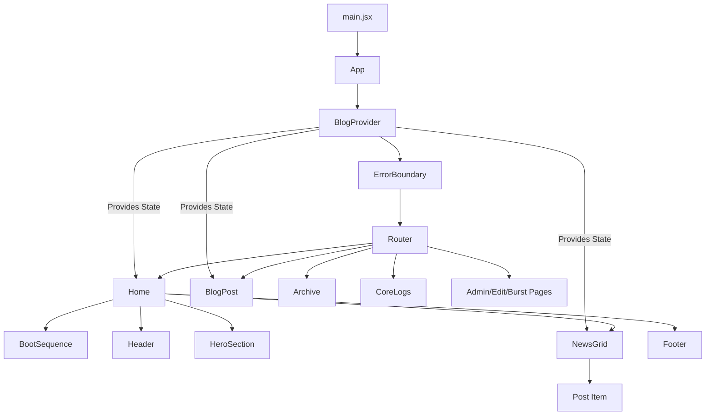

# Project Structure & Architecture

## 1. Directory Structure

```graphql
api/                        # Vercel Serverless Functions (Backend)
├── burst.js                # Manual email broadcast ("Burst") handler
├── cron-digest.js          # Automated weekly digest (Cron Job)
└── subscribe.js            # New subscriber handler (Welcome Email)

src/
├── assets/                 # Static assets (images, icons)
├── components/             # Reusable UI components
│   ├── BootSequence.jsx    # "Matrix-style" initial loading animation
│   ├── DataStream.jsx      # Digital rain effect component
│   ├── ErrorBoundary.jsx   # React error boundary for graceful crash handling
│   ├── Footer.jsx          # Site footer
│   ├── Header.jsx          # Logged-in/out navigation header
│   ├── NewsGrid.jsx        # Displays list of blog posts (from Supabase)
│   └── StatusTicker.jsx    # Scrolling text ticker (if used)
├── context/
│   └── BlogContext.jsx     # Global state management (User, Posts, Auth)
├── data/
│   └── ...                 # Static data files (if any)
├── pages/                  # Route-specific page components
│   ├── About.jsx           # "About" page
│   ├── AdminBurst.jsx      # [NEW] Admin console for sending mass emails
│   ├── Archive.jsx         # Full list of historical posts
│   ├── BlogPost.jsx        # Individual blog post view (/blog/:id)
│   ├── CoreLogs.jsx        # [NEW] Raw system logs view
│   ├── Diagnostics.jsx     # System diagnostics utility
│   ├── EditPost.jsx        # CMS Interface for creating/editing posts
│   ├── EnforcementBypass.jsx # [NEW] Hacker minigame / interactive page
│   ├── JoinNetwork.jsx     # [NEW] Email subscription landing page
│   ├── Login.jsx           # Authentication page
│   ├── NeuralSynapse.jsx   # [NEW] Interactive visual page (Three.js/Canvas like)
│   ├── SystemIntegrity.jsx # [NEW] System health dashboard
│   └── Welcome.jsx         # [NEW] Post-signup landing page
├── App.jsx                 # Main Application Component & Routing
├── main.jsx                # React Entry Point
├── supabaseClient.js       # Supabase Client Configuration
├── index.css               # Global Styles & Tailwind Directives
└── ...                     # Component-specific CSS files
```

## 2. Architecture Overview

### Component Hierarchy (Mermaid)



### Key Systems

#### 1. Routing System (`App.jsx`)
- Uses `createBrowserRouter` from `react-router-dom`.
- Implements **Code Splitting** via `React.lazy()` and `Suspense` for performance.
- Each route (e.g., `/`, `/blog/:id`, `/admin/uplink`) is lazy-loaded.

#### 2. State Management (`BlogContext.jsx`)
- **Purpose**: Centralized state for the application.
- **Key Data**:
    - `posts`: Array of blog posts fetched from Supabase.
    - `user`: Current authenticated user session.
    - `loading` / `error`: Data fetch status.
- **Pattern**: Uses React Context API. Wraps the entire app in `App.jsx`.
- **Caching**: Implements `localStorage` caching (`cached_posts`) for instant "offline-first" feel.

#### 3. Communication System (`/api/*`)
- **Purpose**: Email delivery and automation.
- **Components**:
    - `subscribe.js`: Adds user to `subscribers` table + sends Welcome Email.
    - `burst.js`: Protected endpoint for Admin to blast emails to all active subscribers.
    - `cron-digest.js`: Triggered by Vercel Cron (Wed/Sun 10am UTC) to compile and send "Weekly Digest".
- **Service**: Nodemailer (Gmail SMTP).

#### 4. Data Layer (`supabaseClient.js`)
- **Service**: Supabase (PostgreSQL + Auth).
- **Environment**: Configured via `VITE_SUPABASE_URL` and `VITE_SUPABASE_ANON_KEY`.
- **Usage**:
    - `BlogContext` fetches all posts on mount.
    - `Home` and other pages can subscribe to real-time changes (if implemented).

#### 5. Styling System
- **Core**: Tailwind CSS (utility classes).
- **Custom**: Heavy use of custom CSS files (e.g., `neural-synapse.css`) for the "Cyberpunk" aesthetic.
- **Effects**:
    - Scanlines, CRT flickers, and text glows are handled mostly in CSS.
    - `App.jsx` tracks mouse movement (`--mouse-x`, `--mouse-y`) for dynamic background grids.

## 3. Data Flow

1.  **Frontend Initialization**:
    - App starts. `BlogProvider` initializes.
    - Checks `localStorage` for cached posts.
    - Checks Supabase Auth session.

2.  **Content Fetching**:
    - `useEffect` in `BlogContext` calls `fetchPosts()`.
    - Queries `news_posts` table in Supabase.

3.  **Email Subscription**:
    - User enters email in `JoinNetwork.jsx`.
    - Calls `/api/subscribe`.
    - Backend inserts into DB + Sends Email.

4.  **Admin Broadcast**:
    - Admin clicks "Send Burst" in `AdminBurst.jsx`.
    - Calls `/api/burst` (checks Auth Token from headers).
    - Backend iterates all subscribers and sends email via Nodemailer.

## 4. Connection Map

| Component | Connected To | Reason |
| :--- | :--- | :--- |
| `Home.jsx` | `BlogContext` | Needs list of posts to display in grid. |
| `AdminBurst.jsx` | `api/burst.js` | Triggers manual email broadcast. |
| `JoinNetwork.jsx` | `api/subscribe.js` | Triggers subscription flow. |
| `EditPost.jsx` | `Supabase` | Direct DB writes for creating/updating content. |
| `CoreLogs.jsx` | `BlogContext` | Displays raw list of posts in list view. |
